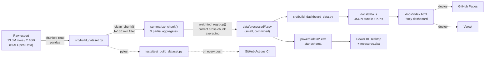

# BIXI Montreal 2024 — Bike Share Analysis

[](https://github.com/fhm-nzh/bixi-montreal-analysis/actions/workflows/ci.yml)
[](LICENSE)
[](pyproject.toml)

**[Live dashboard →](https://fhm-nzh.github.io/bixi-montreal-analysis/)** ·
**[Mirror on Vercel →](https://bixi-montreal-analysis.vercel.app)** ·
**[Power BI build guide →](powerbi/BUILD_GUIDE.md)** (Desktop) ·
**[or fully in-browser →](powerbi/WEB_BUILD_GUIDE.md)** (no Windows needed)

End-to-end analysis of **12.97 million cleaned bike-share trips** (13.28M raw records)
from Montreal's BIXI network across the full 2024 season — from a tested, chunked
pandas pipeline over the raw open-data export, through to an interactive web
dashboard and a Power BI-ready star-schema dataset.


## What's here

| | |
|---|---|
| 🔗 **Live dashboard** | 11 interactive Plotly charts — heatmap, geographic map, weekday/weekend comparison, duration distribution, and more — deployed to both [GitHub Pages](https://fhm-nzh.github.io/bixi-montreal-analysis/) and [Vercel](https://bixi-montreal-analysis.vercel.app) |
| 📊 **Power BI** | Star-schema CSVs + DAX measures + a step-by-step build guide in [`powerbi/`](powerbi/) |
| 🐍 **Data pipeline** | [`src/build_dataset.py`](src/build_dataset.py) — chunked, unit-tested cleaning & aggregation of the 13M-row raw export |
| ✅ **Tests & CI** | [`tests/`](tests/) (pytest) + [`.github/workflows/ci.yml`](.github/workflows/ci.yml) — lint and test run on every push, across two Python versions |
| 📓 **Notebook** | [`notebooks/bixi_analysis.ipynb`](notebooks/bixi_analysis.ipynb) — original exploratory analysis, 6 charts |

## Key findings

- **12,974,146 trips** survived cleaning (removed 301,180 trips / 2.27% with durations
  under 1 minute or over 180 minutes — false starts, docking errors, and forgotten
  checkouts).
- **Métro Mont-Royal** is the busiest station with 116,000+ trips — the top 5 stations
  are all in Le Plateau-Mont-Royal, clustered around the metro.
- **Peak usage is at 9pm (21:00)**, not the morning commute — unusual compared to
  cities where 8–9am dominates. BIXI here skews toward evening/leisure and last-mile
  trips home from the metro rather than commuting to work.
- **July is the busiest month** (2.04M trips); the network is nearly dormant in
  January and February (Montreal winters) — usage swings by more than 30x between
  the slowest and busiest months.
- **Trip duration runs opposite to volume by geography**: peripheral/leisure boroughs
  like **Lachine** (31.9 min avg) and **Rivière-des-Prairies–Pointe-aux-Trembles**
  (30.7 min) have the longest average rides, while the busiest, densest area —
  **Le Plateau-Mont-Royal** — has the *shortest* (11.8 min), consistent with quick
  last-mile metro connections rather than leisure riding.
- **Most popular routes are short loops** in the Plateau (5–7 min, station-to-nearby-station),
  plus one clear outlier: round trips from Parc Jean-Drapeau (~38 min avg) — recreational
  riding on the island park's paths rather than point-to-point transit.
- **The duration distribution is right-skewed**: median trip length is **10.6 min**, well
  below the **13.9 min** mean — most rides are short hops, but a longer tail of leisure
  trips pulls the average up. (Median estimated from a 5-minute-bucket histogram;
  see [`duration_histogram.csv`](data/processed/duration_histogram.csv).)
- **72% of trips happen on weekdays**, and the weekday hourly profile is more sharply
  peaked in the evening than the weekend's — normalizing each group to "% of that
  group's daily trips" (so the comparison isn't just "weekdays have 5 days, weekends
  have 2") shows weekday riding concentrates around the evening commute window, while
  weekend riding spreads flatter across the afternoon, consistent with leisure use.

> Note: the original exploratory pass claimed Plateau-Mont-Royal had the *highest*
> average duration — re-running the aggregation found the opposite (it has the
> shortest). The finding above reflects the verified numbers in
> [`data/processed/duration_by_borough.csv`](data/processed/duration_by_borough.csv).

## Methodology & KPI glossary

### Is it OK to publish this on GitHub?

Yes. A few reasons this is a straightforward case, not a judgment call:

- **The license explicitly allows it.** BIXI publishes this data under a Creative
  Commons Attribution license specifically so it can be reused, analyzed, and
  redistributed — see [bixi.com/en/open-data](https://bixi.com/en/open-data/).
- **It's fully anonymized and station-level.** Every row is a trip: a start
  station, an end station, a start/end timestamp, and derived duration. There is no
  rider ID, membership type, payment information, or anything else that could tie a
  trip back to a person. It's the same category of data transit agencies publish for
  GTFS ridership dashboards.
- **Nothing in this repo adds risk beyond the source data.** The pipeline only
  aggregates further (by hour, station, borough, etc.) — the published outputs are
  *less* granular than the raw export, not more.

The one thing worth being deliberate about: **don't republish the raw 2.4GB file
itself** (this repo doesn't — `data/raw/` is gitignored, with instructions to fetch
it directly from BIXI). Linking to the source and publishing your own *derived,
aggregated* analysis is the normal, expected way to use open data — publishing a
mirror of someone else's raw export is a separate question this project avoids
by construction.

### Data cleaning rule

A trip is kept when `1 ≤ duration_min ≤ 180`. Below 1 minute is almost always a
false start or docking error, not a real ride; above 180 minutes is far more likely
a forgotten checkout than someone actually riding for 3+ hours. This is the one
judgment call in the pipeline — it's applied identically everywhere (pipeline,
dashboard, Power BI) via `MIN_DURATION_MIN` / `MAX_DURATION_MIN` in
[`src/build_dataset.py`](src/build_dataset.py), and its impact is reported
transparently (2.27% of rows removed) rather than hidden.

### KPI definitions

| KPI | Definition | Computed in |
|---|---|---|
| **Total trips (cleaned)** | Count of trips passing the duration filter | `summary.csv` |
| **Removed %** | `(raw_rows − kept_rows) / raw_rows` | `summary.csv` |
| **Avg trip duration** | Trip-count-weighted mean of `duration_min` across all trips | `duration_by_borough.csv`, weighted |
| **Median trip duration** | Linear interpolation within the 5-minute bucket containing the 50th-percentile trip | `duration_histogram.csv` |
| **Busiest station** | Start station with the highest lifetime trip count | `trips_by_station.csv` |
| **Peak hour** | Hour-of-day (0–23) with the highest total trip count across the year | `trips_by_hour.csv` |
| **Busiest month** | Calendar month with the highest trip count | `trips_by_month.csv` |
| **Weekday / weekend share** | % of trips whose start date falls on Sat/Sun vs. Mon–Fri | `trips_by_weekend_hour.csv` |
| **Avg duration by borough** | Trip-count-weighted mean `duration_min`, grouped by the *start* station's borough | `duration_by_borough.csv` |

The weighting matters: naively averaging a set of already-averaged numbers (e.g. one
avg-duration figure per processing chunk, or per station) silently mis-weights groups
of different sizes. Every "avg duration" figure above is reconstructed as
`Σ(count × avg) / Σ(count)`, not a plain mean — see `weighted_regroup()` in
[`src/build_dataset.py`](src/build_dataset.py), which is unit-tested specifically
against this failure mode.

## Architecture



The pipeline is intentionally decoupled from both consumers: `build_dataset.py`
knows nothing about Plotly or Power BI, it just produces small, correct, tested
CSVs — the dashboard and the BI report are two independent, swappable views onto
the same processed data.

## Testing & CI

```bash
pytest tests/ -v        # 8 tests: cleaning filter, weighted re-aggregation, bucketing, end-to-end run
ruff check src/ tests/  # lint
```

`weighted_regroup` — the function that recombines per-chunk averages — is the
easiest place for a chunked pipeline to silently produce a *wrong but plausible*
number (a naive mean-of-means under/over-weights chunks of different sizes). It's
covered by a test that checks the result against directly aggregating the raw
per-trip durations, not just against itself. CI ([`.github/workflows/ci.yml`](.github/workflows/ci.yml))
runs lint + tests on Python 3.10 and 3.12 on every push, plus a job that parses
`docs/data.js` and checks its shape so a broken dashboard deploy fails loudly
instead of shipping a blank page.

## Dashboard

The live dashboard ([source](docs/index.html)) is a single self-contained HTML page —
no backend, just Plotly.js reading a small pre-aggregated JSON bundle
([`src/build_dashboard_data.py`](src/build_dashboard_data.py)). It's organized into four
sections with sticky navigation (**Overview · Time patterns · Stations & map · Boroughs**),
11 charts total:

**Time patterns**
- KPI tiles: total trips, mean/median duration, busiest station/hour/month, weekday share
- A month filter that drives the hour-of-day and day-of-week charts
- Trips by hour, day of week, and month
- **Hour × day-of-week heatmap** — the full weekly rhythm at a glance, toggle between
  trip volume and average duration as the color metric
- **Weekday vs. weekend hourly profile** — each line normalized to % of that group's
  daily trips, so the *shape* of commute vs. leisure use is comparable regardless of
  the different underlying totals (5 weekdays vs. 2 weekend days)
- **Trip duration distribution** — a histogram with mean/median reference lines,
  visualizing the right-skew directly

**Stations & map**
- Top 10 stations and top 10 routes
- **Interactive station map** (1,097 stations, Plotly `scattermapbox` with a
  token-free basemap that switches with light/dark mode) — size and color both
  encode trip volume, filterable by borough

**Boroughs**
- Average trip duration by borough (all 25 boroughs, sequential color scale)
- **Volume vs. duration scatter** — quantifies the inverse relationship between how
  busy a borough is and how long its average ride runs, with the busiest/longest
  boroughs directly labeled

**Throughout**
- Sortable data tables for accessibility / non-chart reference
- Light and dark mode (follows system preference)
- A visible error state (not a blank page) if the data bundle ever fails to load
- Open Graph / Twitter Card previews for sharing the link

## Power BI

Power BI Desktop is Windows-only, so it can't be authored directly in this repo — but
everything needed to build it yourself in ~15–20 minutes is in [`powerbi/`](powerbi/):
an 8-table star schema (`Fact_DailyStation`, `Fact_Hourly`, `Fact_Routes`,
`Fact_HourDayOfWeek`, `Fact_WeekendHour`, `Fact_DurationHistogram`, `Dim_Station`,
`Dim_Date`), 11 ready-to-paste DAX measures, and a 4-page build guide covering
relationships, measures, report layout (including the heatmap matrix, weekday/weekend
comparison, duration histogram, and station map), and publishing.

Two ways to build it, same dataset and DAX either way:

- **[`BUILD_GUIDE.md`](powerbi/BUILD_GUIDE.md)** — Power BI Desktop (free, Windows-only).
- **[`WEB_BUILD_GUIDE.md`](powerbi/WEB_BUILD_GUIDE.md)** — entirely in the browser at
  app.powerbi.com, using Dataflows + a Datamart for the relationships and measures a
  plain CSV upload can't give you. Requires a Premium/PPU/Fabric-licensed workspace
  (a free Fabric trial covers this, but needs a work/school account — see the guide
  for the exact gate and the fallback if you don't have one).

## Project structure

```
bixi-montreal-analysis/
├── .github/workflows/ci.yml # lint + test on every push (2 Python versions)
├── docs/                     # live dashboard (GitHub Pages / Vercel source)
│   ├── index.html            # 11 charts, 4 sections, sticky nav
│   ├── data.js               # pre-aggregated data bundle, generated by build_dashboard_data.py
│   └── og-image.png          # social preview card
├── src/
│   ├── build_dataset.py      # chunked cleaning + aggregation pipeline (13M rows -> small CSVs)
│   └── build_dashboard_data.py # bundles data/processed/*.csv -> docs/data.js
├── tests/
│   └── test_build_dataset.py # pytest — cleaning filter, weighted re-aggregation, end-to-end
├── data/
│   ├── raw/                  # raw BIXI export (gitignored — see data/raw/README.md)
│   └── processed/            # aggregated output of build_dataset.py (committed, small)
├── powerbi/
│   ├── data/                 # star-schema CSVs for Power BI import
│   ├── measures.dax          # DAX measures, ready to paste
│   └── BUILD_GUIDE.md
├── notebooks/
│   └── bixi_analysis.ipynb   # original exploratory analysis
├── images/                   # static chart exports from the notebook
├── vercel.json / .vercelignore
├── pyproject.toml            # ruff + pytest config
├── Makefile
├── requirements.txt / requirements-dev.txt
└── LICENSE
```

## Reproducing this

```bash
# 1. Get the raw data (see data/raw/README.md for the direct link)
#    unzip it, place "DonneesOuvertes (2).csv" in data/raw/

# 2. Install dependencies (add -dev for pytest/ruff)
pip install -r requirements-dev.txt

# 3. Run the pipeline — cleans + aggregates the 13M-row export into data/processed/
python src/build_dataset.py --raw "data/raw/DonneesOuvertes (2).csv"
# — or —
make pipeline

# 4. Rebuild the dashboard's data bundle from the processed CSVs
python src/build_dashboard_data.py

# 5. Run the test suite / lint
make test
make lint

# 6. Open the dashboard directly (no server needed)
make dashboard

# — or explore interactively —
jupyter notebook notebooks/bixi_analysis.ipynb
```

## Tools used

- **Python** — pandas (chunked processing of a 2.4GB / 13.3M-row CSV), matplotlib, seaborn
- **pytest + ruff** — unit tests and linting, enforced in CI
- **GitHub Actions** — CI (lint, test, dashboard-data validation) on every push
- **Plotly.js** — interactive web dashboard
- **Power BI** — DAX measures, star-schema modeling
- **GitHub Pages & Vercel** — dashboard hosting

## What this project demonstrates

- Handling data at a scale that doesn't fit a naive `pd.read_csv()` approach
  (chunked processing of a 2.4GB file) without losing statistical correctness
  (the weighted re-aggregation problem, tested explicitly).
- Treating a data pipeline as software: pure, typed, testable functions;
  a real test suite; CI; linting — not just a notebook that "ran fine once."
- Shipping the same underlying analysis to three different audiences (a live
  interactive dashboard, a BI tool, a notebook) from one source of truth.
- Catching and correcting a wrong claim in the original analysis by re-deriving
  it from the data rather than taking a prior finding on faith.
- Reaching for the right chart for the question: a heatmap for a two-dimensional
  pattern (hour × day), a normalized overlay when raw magnitude would be misleading
  (weekday vs. weekend), mean *and* median together when a distribution is skewed,
  and a geographic map when the story is spatial.
- Documenting methodology and KPI definitions precisely enough that someone else
  could audit or reproduce every number on the dashboard.
- End-to-end ownership: sourcing the data, building the pipeline, designing the
  dashboard, and deploying it — twice, to two different platforms.

## Data source

[BIXI Montreal Open Data](https://bixi.com/en/open-data/) — Creative Commons Attribution License.

## License

Code in this repository is [MIT licensed](LICENSE). The underlying trip data
remains under BIXI's Creative Commons Attribution license.
