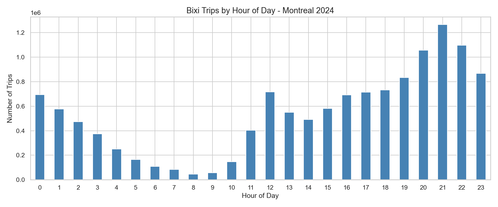

# BIXI Montreal 2024 — Bike Share Analysis

**[Live dashboard →](https://fhm-nzh.github.io/bixi-montreal-analysis/)** ·  **[Power BI build guide →](powerbi/BUILD_GUIDE.md)**

End-to-end analysis of **12.97 million cleaned bike-share trips** (13.28M raw records)
from Montreal's BIXI network across the full 2024 season — from a chunked pandas
pipeline over the raw open-data export, through to an interactive web dashboard and
a Power BI-ready star-schema dataset.



## What's here

| | |
|---|---|
| 🔗 **Live dashboard** | Interactive Plotly dashboard with month filtering, KPI tiles, and data tables — [fhm-nzh.github.io/bixi-montreal-analysis](https://fhm-nzh.github.io/bixi-montreal-analysis/) |
| 📊 **Power BI** | Star-schema CSVs + DAX measures + a step-by-step build guide in [`powerbi/`](powerbi/) |
| 🐍 **Data pipeline** | [`src/build_dataset.py`](src/build_dataset.py) — chunked cleaning & aggregation of the 13M-row raw export |
| 📓 **Notebook** | [`notebooks/bixi_analysis.ipynb`](notebooks/bixi_analysis.ipynb) — original exploratory analysis, 6 charts |

## Key findings

- **12,974,146 trips** survived cleaning (removed 301,180 trips / 2.27% with durations
  under 1 minute or over 180 minutes — false starts, docking errors, and forgotten
  checkouts).
- **Métro Mont-Royal** is the busiest station with 116,000+ trips — the top 5 stations
  are all in Le Plateau-Mont-Royal, clustered around the metro.
- **Peak usage is at 9pm (21:00)**, not the morning commute — unusual compared to
  cities where 8–9am dominates. BIXI here skews toward evening/leisure and last-mile
  trips home from the metro rather than commuting to work.
- **July is the busiest month** (2.04M trips); the network is nearly dormant in
  January and February (Montreal winters) — usage swings by more than 30x between
  the slowest and busiest months.
- **Trip duration runs opposite to volume by geography**: peripheral/leisure boroughs
  like **Lachine** (31.9 min avg) and **Rivière-des-Prairies–Pointe-aux-Trembles**
  (30.7 min) have the longest average rides, while the busiest, densest area —
  **Le Plateau-Mont-Royal** — has the *shortest* (11.8 min), consistent with quick
  last-mile metro connections rather than leisure riding.
- **Most popular routes are short loops** in the Plateau (5–7 min, station-to-nearby-station),
  plus one clear outlier: round trips from Parc Jean-Drapeau (~38 min avg) — recreational
  riding on the island park's paths rather than point-to-point transit.

> Note: the original exploratory pass claimed Plateau-Mont-Royal had the *highest*
> average duration — re-running the aggregation found the opposite (it has the
> shortest). The finding above reflects the verified numbers in
> [`data/processed/duration_by_borough.csv`](data/processed/duration_by_borough.csv).

## Dashboard

The live dashboard ([source](docs/index.html)) is a single self-contained HTML page —
no backend, just Plotly.js reading a small pre-aggregated JSON bundle. It includes:

- KPI tiles (total trips, avg duration, busiest station/hour/month)
- A month filter that drives the hour-of-day and day-of-week charts
- Trips by hour, day of week, and month
- Top 10 stations and top 10 routes
- Average trip duration by borough (all 25 boroughs, sequential color scale)
- Sortable data tables for accessibility / non-chart reference
- Light and dark mode (follows system preference)

## Power BI

Power BI Desktop is Windows-only, so it can't be authored directly in this repo — but
everything needed to build it yourself in ~15 minutes is in [`powerbi/`](powerbi/):
a 5-table star schema (`Fact_DailyStation`, `Fact_Hourly`, `Fact_Routes`, `Dim_Station`,
`Dim_Date`), 11 ready-to-paste DAX measures, and a page-by-page
[build guide](powerbi/BUILD_GUIDE.md) covering relationships, measures, report layout,
and publishing.

## Project structure

```
bixi-montreal-analysis/
├── docs/                    # live dashboard (GitHub Pages source)
│   ├── index.html
│   └── data.js              # pre-aggregated data bundle, generated from data/processed/
├── src/
│   └── build_dataset.py     # chunked cleaning + aggregation pipeline (13M rows -> small CSVs)
├── data/
│   ├── raw/                 # raw BIXI export (gitignored — see data/raw/README.md)
│   └── processed/           # aggregated output of build_dataset.py (committed, small)
├── powerbi/
│   ├── data/                # star-schema CSVs for Power BI import
│   ├── measures.dax         # DAX measures, ready to paste
│   └── BUILD_GUIDE.md
├── notebooks/
│   └── bixi_analysis.ipynb  # original exploratory analysis
├── images/                  # static chart exports from the notebook
└── requirements.txt
```

## Reproducing this

```bash
# 1. Get the raw data (see data/raw/README.md for the direct link)
#    unzip it, place "DonneesOuvertes (2).csv" in data/raw/

# 2. Install dependencies
pip install -r requirements.txt

# 3. Run the pipeline — cleans + aggregates the 13M-row export into data/processed/
python src/build_dataset.py --raw "data/raw/DonneesOuvertes (2).csv"

# 4. Open the dashboard directly (no server needed)
open docs/index.html

# — or explore interactively —
jupyter notebook notebooks/bixi_analysis.ipynb
```

## Tools used

- **Python** — pandas (chunked processing of a 2.4GB / 13.3M-row CSV), matplotlib, seaborn
- **Plotly.js** — interactive web dashboard
- **Power BI** — DAX measures, star-schema modeling
- **GitHub Pages** — dashboard hosting

## Data source

[BIXI Montreal Open Data](https://bixi.com/en/open-data/) — Creative Commons Attribution License.
